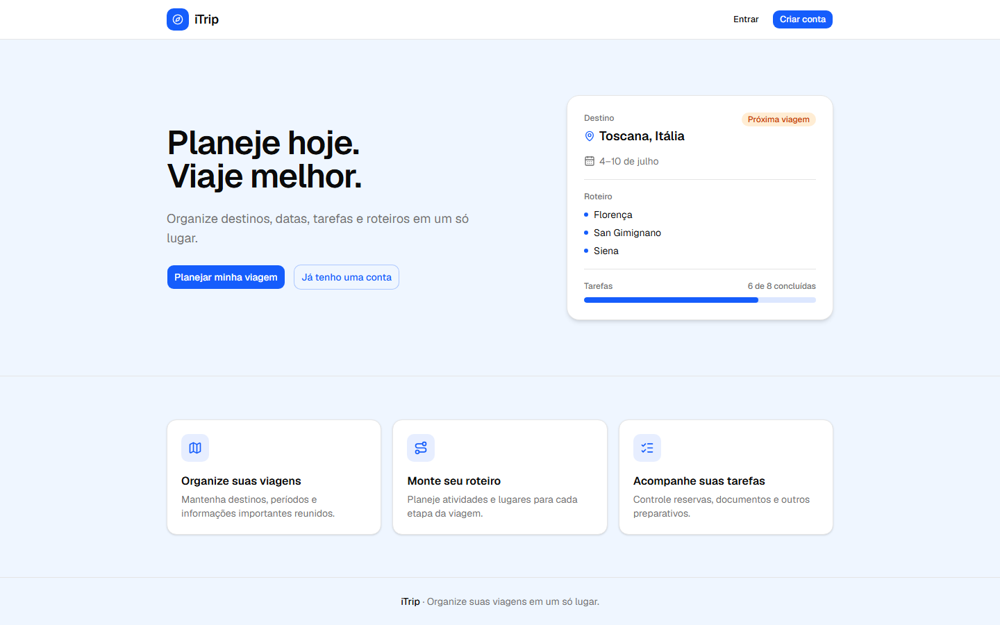
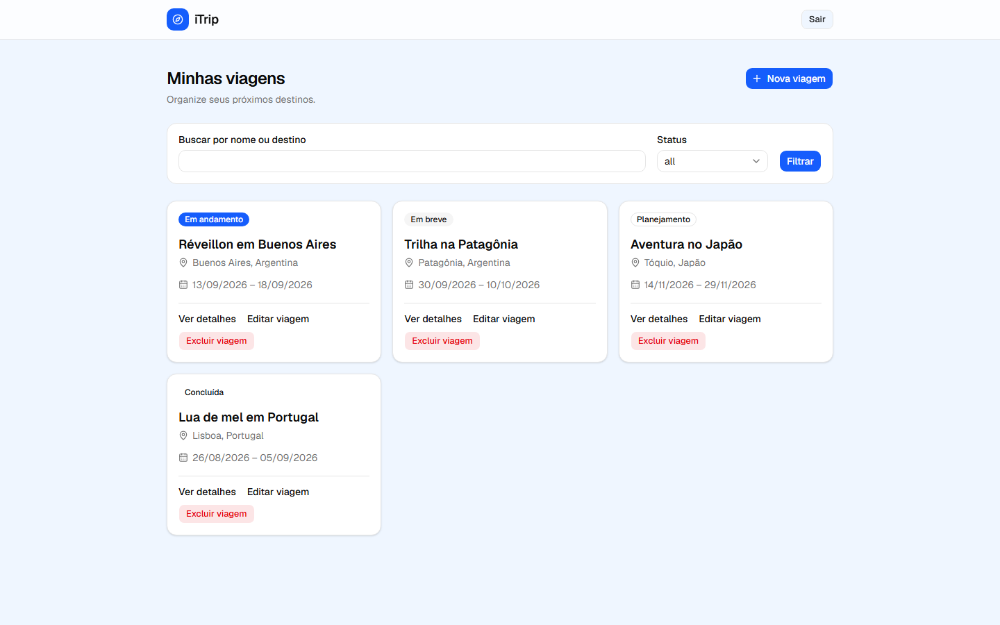
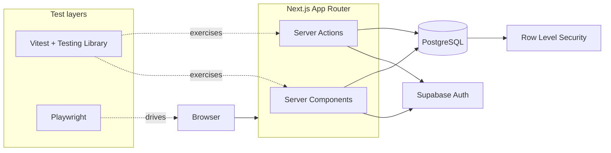

# iTrip

**Plan your trips. Ship quality on top of them.**

iTrip is a full-stack travel planning MVP built as the target application for a
hands-on Quality Engineering portfolio. It lets people sign up, manage their trips,
and keep a simple itinerary — and it exists so that authentication, business rules,
data ownership, and UI flows can be tested the way a real product would be.


## Preview

**Landing page**



**Authenticated dashboard**



## About the project

Trip planning tends to end up scattered across notes apps, spreadsheets, and chat
threads: destinations, dates, and the small tasks around a trip rarely live in one
place. iTrip gives that a single, structured home — sign up, create a trip with its
destination and dates, write a free-form itinerary, and find it later by name,
destination, or status.

This is not a repository of tests bolted onto a toy app. iTrip was built with real
constraints on purpose: authenticated routes, server-side authorization checks,
row-level data ownership in PostgreSQL, input validation, and generic error
responses that don't leak internal state. Those are the boundaries a Quality
Engineering practice actually needs to exercise, so the application is deliberately
built to have them.

The UI is currently in Brazilian Portuguese (the interface copy in the screenshots
reflects that); this document and the codebase are in English.

## Key features

- Sign-up, login and logout.
- Protected dashboard routes.
- Trip creation, viewing, editing and deletion.
- Destination and date management.
- Free-form travel itinerary per trip.
- Search by trip name or destination.
- Filtering by derived trip status (planning, upcoming, ongoing, completed).
- Accessible form validation and user feedback (labeled fields, `aria-invalid`,
  `aria-describedby`, live error/status regions).
- Responsive layout for desktop and mobile.
- Light and dark color themes defined at the design-token level (no in-app toggle
  yet — see roadmap).
- Local, deterministic seed data for two test accounts.

## Quality Engineering highlights

This is the section that matters most for this portfolio. What exists today:

- Unit tests with Vitest and Testing Library, covering schemas, data mappers, date
  handling, and UI components.
- Integration tests against a real local Supabase instance, covering authentication
  behavior, database constraints, and Row Level Security policies for every table.
- An initial Playwright smoke test that runs against the actual Docker production
  build, not the dev server.
- Semantic, accessible selectors (roles, labels, visible text) used throughout the
  UI — the same properties Playwright's recommended locators rely on.
- Deterministic local users and seeded trip data, so test runs start from a known
  state.
- Schema validation with Zod on every form and Server Action input.
- Security boundaries enforced by PostgreSQL Row Level Security, not just
  application-layer checks.
- Liveness (`/api/health`) and readiness (`/api/ready`) endpoints.
- Failure artifacts configured in Playwright (trace, screenshot, and video are kept
  only when a test fails).

| Test layer  | Tool                     | Current scope                                             |
| ----------- | ------------------------ | --------------------------------------------------------- |
| Unit        | Vitest + Testing Library | Schemas, mappings, dates and UI components                |
| Integration | Vitest + Supabase        | Auth, constraints, trips and RLS policies                 |
| E2E         | Playwright               | Initial public smoke test; auth and CRUD coverage planned |

## Architecture



Server Components read data directly; Server Actions handle mutations. Both
re-check the session server-side on every call rather than trusting the routing
layer alone, and every query/mutation is still subject to PostgreSQL RLS regardless
of what the application code does. Details in [`docs/security.md`](docs/security.md).

## Tech stack

| Area                        | Technologies                                        |
| --------------------------- | --------------------------------------------------- |
| Frontend                    | Next.js, React, TypeScript, Tailwind CSS, shadcn/ui |
| Forms and validation        | React Hook Form, Zod                                |
| Backend                     | Next.js Server Actions                              |
| Authentication and database | Supabase Auth, PostgreSQL, Row Level Security       |
| Testing                     | Playwright, Vitest, Testing Library                 |
| Infrastructure              | Docker, Docker Compose, Supabase CLI                |

## Running locally

### Prerequisites

- Node.js `24.12.0` (see `.nvmrc` / `.node-version`)
- npm `>=11.6.2`
- Docker Desktop (or Docker Engine on Linux)
- [Supabase CLI](https://supabase.com/docs/guides/cli)

### Setup

```sh
# 1. Clone the repository
git clone <this-repository-url>
cd itrip_mvp

# 2. Install dependencies
npm ci

# 3. Configure environment variables
cp .env.example .env.local
# then fill in NEXT_PUBLIC_SUPABASE_ANON_KEY from `npm run supabase:status` (step 4)

# 4. Start the local Supabase stack (Postgres, Auth, PostgREST, Studio, ...)
npm run supabase:start
npm run supabase:status   # copy the anon key into .env.local

# 5. Apply migrations and seed local test data
npm run db:reset

# 6. Build and start the app in Docker
npm run docker:up

# 7. Open the app
# http://localhost:3002
```

`npm run dev` also works for local, non-containerized development (defaults to
`http://localhost:3000`, or the next free port). The Docker flow above is what
actually mirrors production and is what the Playwright suite targets.

Full environment details, port mapping, and the local-vs-hosted Supabase
distinction are documented in
[`docs/local-environment.md`](docs/local-environment.md).

### Local test accounts

Created by `npm run db:reset` / `npm run db:seed:users`, for the local environment
only:

| Email                 | Password         |
| --------------------- | ---------------- |
| `debora@example.test` | `ItripLocal123!` |
| `hugo@example.test`   | `ItripLocal123!` |

These credentials only exist in the local Supabase stack seeded by this project —
they are not valid against any hosted environment.

## Running the tests

| Command                    | Runs                                             | Requires                               |
| -------------------------- | ------------------------------------------------ | -------------------------------------- |
| `npm run test:unit`        | Unit tests (Vitest + Testing Library)            | Nothing extra                          |
| `npm run test:integration` | Integration tests against real Postgres/Supabase | `npm run supabase:start` running       |
| `npm run test:e2e`         | Playwright smoke test                            | The app running in Docker on port 3002 |
| `npm run test:e2e:ui`      | Playwright in UI mode                            | Same as above                          |
| `npm run test:e2e:report`  | Opens the last Playwright HTML report            | A previous `test:e2e` run              |
| `npm run lint`             | ESLint                                           | Nothing extra                          |
| `npm run typecheck`        | Next.js type generation + `tsc --noEmit`         | Nothing extra                          |
| `npm run build`            | Production build                                 | Nothing extra                          |
| `npm run validate`         | Format check, lint, typecheck, unit tests, build | Nothing extra                          |

`npm run validate` does **not** run integration or E2E tests — both need external
services (Supabase, or a running Docker container) that aren't assumed to be up in
every environment, so they're run explicitly and separately.

## Security highlights

- PostgreSQL Row Level Security as the actual data-access boundary — not just an
  application-layer check — on every domain table.
- Server-side session verification on protected routes and every mutation, not
  assumed from the routing layer alone.
- Protected dashboard routing with a login redirect that only accepts a small,
  allow-listed set of destinations.
- Generic authentication and mutation error messages that don't reveal whether a
  record exists, belongs to someone else, or simply failed.
- Strict validation of environment configuration, including guardrails in the local
  seed script that refuse to run against anything but a local Supabase instance.
- Ownership protection for trip records, enforced by RLS policies, not by
  filtering results in application code.

Full write-up, including verified request/response examples and the reasoning
behind each decision, is in [`docs/security.md`](docs/security.md).

## Project status and roadmap

The MVP application is functional today. The test automation portfolio built on
top of it is still growing.

**Done**

- [x] Application foundation (Next.js, TypeScript, Tailwind, shadcn/ui)
- [x] Local Supabase environment (Docker + Supabase CLI)
- [x] Database schema and Row Level Security policies
- [x] Authentication (sign-up, login, logout)
- [x] Trip CRUD (create, view, edit, delete)
- [x] Search and status filters
- [x] Free-form travel itinerary
- [x] Unit and integration test foundations
- [x] Initial Playwright smoke test
- [x] Docker production build

**Planned**

- [ ] Playwright authentication coverage
- [ ] Reusable authenticated fixtures and storage state
- [ ] Trip CRUD E2E scenarios
- [ ] Search and filtering E2E coverage
- [ ] Cross-browser execution
- [ ] CI pipeline
- [ ] Test reports and a documented QA strategy
- [ ] In-app light/dark theme toggle

## Repository structure

```
app/            Next.js App Router routes, layouts, and API routes
components/     Shared UI primitives (shadcn/ui) and cross-page components
features/       Domain logic by feature (auth, trips) — actions, schemas, components
lib/            Framework-agnostic helpers (Supabase clients, auth, dates)
supabase/       Migrations, seed script, local Supabase config
docs/           Project documentation (security, database, local environment)
unit-tests/     Vitest unit and integration tests
tests/e2e/      Playwright end-to-end tests
```

## Author

**Débora Lourenço Silva**
QA Engineer | Manual Testing & Test Automation

[LinkedIn — add profile URL]
[GitHub — add profile URL]
